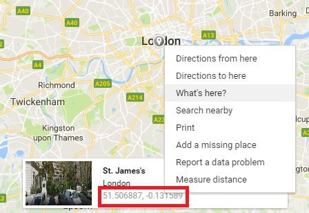

---
title: Countries Maps
level: JavaScript
language: en-GB
embeds: "*.png"
materials: ["dist/*.*","res/*.*"]
stylesheet: web
...

# Introduction { .intro}

In this lesson we will display a list of counties onto a map using a special __location__.<br>
There are many different maps on the internet, but we are going to be using Google Maps.<br>
__Note:__ You can read about [Google Maps here](https://www.w3schools.com/graphics/google_maps_intro.asp)

First of all let us type a basic page.

# Creating our basic page

Let's create our basic page:

```HTML
<html>
    <head>
    </head>
    <body>
    </body>
</html>
```

## Reference Google Maps

The first thing we have to do it to add a `<script>` at the top the references the Google Maps library.<br>
At the top of your page, inside the `<head>`, place the following code:

```HTML
<script src="https://maps.googleapis.com/maps/api/js"></script>
```

Here we are saying that we want to include a new script with it's source at the Google Maps website.<br>

> If you are curious, API stands for __Application Programming Interface__

## `load` event and container

So we want our page to display the countries on a map when it first load up, to do this we type the name of the function that will display the country for the __onclick__ event on the `<body>` of our page.<br>
But that is not all, we also need a container that will be the place where we place our countries.

Copy the follow markup into your page:

```HTML
<body onload="displayCountries()">
    <div id="countries-container" style="width:100%;height:100%;">
    </div>
</body>
```

That's it, now let's add the script to make it work!

# Adding the script
## Array of countries

Let's create a list of countries we will use to display on our map, our countries will all have a special property, this property will be called __location__ and it will be an object made up of two more properties: __lat__ and __lng__:

```JavaScript
location : {
     lat : ...,
     lng : ...
}
```

But what do they mean?<br>
Well, in geography, locations or coordinates on the earth are represented using two numbers called __latitude__ (lat) and __longitude__ (lng).<br>

We can use the internet to find some coordinates.<br>
Open up a web browser and navigate to https://www.google.co.uk/maps/<br>
Now click on the right mouse button and a menu will appear, click on the option that says "What's here?"<br>
Once you have clicked on the button, a window will appear at the bottom of the screen, inside this window you can see the name of the location you have clicked on, underneath the name are the latitude and longitude coordinates.<br>



Now you know how to find your own latitude and longitude coordinates, you can use your own coordinates or use to ones in this lesson.<br>
Here are the full list of countries with their __location__ properties:

```JavaScript
var countries = [
    { name: "Bermuda", img: "img/bermuda.png", location: { lat: 32.318942, lng: -64.749584 } },
    { name: "Bhutan", img: "img/bhutan.png", location: { lat: 27.395674, lng: 90.449783 } },
    { name: "Fiji", img: "img/fiji.png", location: { lat: -17.496026, lng: 178.724850 } },
    { name: "Galapagos", img: "img/galapagos.png", location: { lat: -0.526364, lng: -90.691124 } }
];
```

We also need a varible that we will use to store our map, we do not assign anything to it yet, just creatte it so that we can use it later on.

```JavaScript
var map;
```

Now that we have the countries created, let's move on to the function that will display these locations on a map.

# Main `displayCountries` function

Let's add a empty `displayCountries()` function that we will add code to later:

```JavaScript
function displayCountries() {

}
```

So now that we have our function in place, let's think about what we want to put in it.<br>
Let's break our function down, what do we want to do?
1) Create the map
2) Display the selected country's location a map

Okay so we can see that there are two things that we want to do in our function, let's take them in turn.

## Create the map

Normally we would create a function for each step, but it is okay to put this code in our main function.<br>
Type the following code in you `displayCountries` function:

```JavaScript
var container = document.getElementById("countries-container");
map = new google.maps.Map(container, {
    center : { lat : 0, lng : 0 },
    zoom: 2
});
```

This might look a little bit complicated, but we actually have only two statements, let's see what is going on.<br>

1) In the first statement we are getting a refference to our `container` and assigning that to a new varible.<br>
2) In the secound statement we are creating a [Google Maps Object](https://developers.google.com/maps/documentation/javascript/3.exp/reference#Map), we are giving it our `container`.<br>
We are also giving the `Map()` function a configuration object that has two properties: center and zoom.<br>
We wish to centre the map just beyond the centre or the earth so we create a special __location__ object that is set to 0 and assign it to the `center` property in the configuration object.<br>
We also set the `zoom` property because we want to to be able to see all of our countries.<br>

Now our main function looks like this:

```JavaScript
function displayCountries() {
    var container = document.getElementById("countries-container");
    map = new google.maps.Map(container, {
        center : { lat : 0, lng : 40 },
        zoom: 2
    });
}
```

So that's the first part of our function done, now on to the second.

## Mark the country on the map

Now we move on to creating the second part.<br>
We want to display a given country on the map, so let's create a new function called `displayCountryOnMap`.<br>

```JavaScript
function DisplayCountryOnMap(country) {
    new google.maps.Marker({
        position: country.location,
        map: map,
        label: country.name,
        icon : country.img
    });
}
```

Here we are jus creating a new marker using the [Google Maps Marker object](https://developers.google.com/maps/documentation/javascript/3.exp/reference#marker)<br>
The Marker object also takes a configuration object, we are setting the congfiguration object's properties using the country's location, name and img properties, we are also telling the Marker that the map we want to use is our `map` varible.<br>

Now that we have created this function, let's call it in our main function<br>
We call the function by passing it into the `forEach` function of of our `countries` array.<br
__Note:__ You can read more about the [forEach function here](https://www.w3schools.com/jsref/jsref_forEach.asp)<br>
Type the following code at the end of your main `displayCountries` function:

```JavaScript
countries.forEach(DisplayCountryOnMap);
```

Here we are saying that for each country in our array, we want to display it on the map, simple!

# It works!

Now we have created all the parts for our main function, let's save our work and open up the page in a web browser.<br>
Our map displays and we can see all of our countries marked out.

# Challanges
## Challenge 1 - Add your own country

This challange is very simple, all we need to do is to add a new object onto our `countries` array.<br>
Type the following code onto the end of your `countries` array, remember to add a comma (`,`) to the end of the pervious item:

```JavaScript
{ name: "United Kingdom", img: "img/bermuda.png", location: { lat: 54.4278109, lng: -4.3659038 } }
```

That's it, challenge completed!<br>
Your array of countries should look like the following:

```JavaScript
var countries = [
    { name: "Bermuda", img: "img/bermuda.png", location: { lat: 32.318942, lng: -64.749584 } },
    { name: "Bhutan", img: "img/bhutan.png", location: { lat: 27.395674, lng: 90.449783 } },
    { name: "Fiji", img: "img/fiji.png", location: { lat: -17.496026, lng: 178.724850 } },
    { name: "Galapagos", img: "img/galapagos.png", location: { lat: -0.526364, lng: -90.691124 } },
    { name: "United Kingdom", img: "img/bermuda.png", location: { lat: 54.4278109, lng: -4.3659038 } }
];
```

## Challange 2 - Info window

This challenge is a little bit bigger than the last.

We're going to add a `click` event to our markers, this click event will then open up an information window that will display a Wikipedia article about the counrty.<br>
Let's create a new function that will display the country's information:

```JavaScript
function DisplayCountryInfo(country) {
    var html = '<iframe width="400px" height="400px" src="http://en.wikipedia.org/wiki/' + country.name + '"></iframe>';
    var window = new google.maps.InfoWindow({ content : html });
    window.open(map, this);
}
```

1) In the first statement of this function (`var html = ...`) we are creating the content of our information window, we are saying that we would like to dispolay a `iframe` that is pointing to the Wikipedia article about our country.<br>
Notice how we are constucting the `HTML` varible with both single and double quotes (`'` and `"`), this is so our browser does not become confussed, we are using matching single quotes on the outside and double quotes on the inside.
2) In the second statement we are constructing our [Google Map InfoWindow object](https://developers.google.com/maps/documentation/javascript/3.exp/reference#InfoWindow), this function also takes in another configuration object, here we are assigning the window's content to the HTML we have just created.
3) Lastly we are opening the window by calling it's __open__ function, we are giving it our `map` object and also using the special __this__ keyword which is _this_ marker that we have clicked on.

Next we need to create a `marker` oject and add a event listener to to it.<br>
But we are already creating a marker with the code `new google.maps.Marker(...)` in our function `DisplayCountryOnMap`, so all we need to do is assign that new marker to a virible:
```JavaScript
var marker = new google.maps.Marker(...)
```

And then add a listener to it:

```JavaScript
marker.addListener('click', function() {
    DisplayCountryInfo.call(marker, country);
});
```

Here we are using the function __call__ the call our function.<br>
Remember the special keyword __this__? By using the __call__ function we are are assigning the `marker` varible to the keywork __this__.<br>
__Note:__ You can read more about the [call function here](https://www.w3schools.com/js/js_function_call.asp)

So now our whole function looks like this:

```JavaScript
function DisplayCountryOnMap(country) {
    var marker = new google.maps.Marker({
        position: country.location,
        map: map,
        label: country.name,
        icon : country.img,
        
    });
    marker.addListener('click', function() {
        DisplayCountryInfo.call(marker, country);
    });
}
```

# End of lesson

Phew so that's the end of this lesson, in the next lesson we will add to our webpage to make it more colourful and interesting, for now just relax and let what we have learnt sink in.

