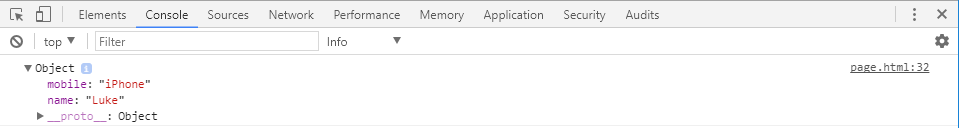

---
title: Questions - Build an object
level: JavaScript
language: en-GB
embeds: "*.png"
materials: ["dist/*.*","res/*.*"]
stylesheet: web
...

# Introduction

In this lesson we are going to build an object by answering questions about ourselves.

# Create the `page.html`

First of all we are going to need a page that will run our script, let's create a standard HTML page.

```HTML
<html>
    <head>
        <script>
        </script>
    </head>
    <body>
        <button onclick="questions()">Ask me some questions!</button>
    </body>
</html>
```

You can see in the above HTML code we have created our basic page with a `<script>` block and a button that will call a __function__ that will ask us some questions about yourselves.

Now save the file by clicking __File -> Save As__ making sure that the file is saved with '.html' at the end.<br>
<i>Ask you teacher if you need some help</i>

# Create an empty object

We need somewhere to store the answers to to the question.<br>
Let's create an object that we will store the answers into<br>
__Note:__ Read more about [objects here](https://www.w3schools.com/js/js_objects.asp).

```JavaScript
var me = {};
```

In JavaScript, objects are _dynamic_ which means that we can easily fill up our object with properties as we go along.<br>
Let's fill up our object now.

# Create the `questions()` function

Now let us create a `function` inside our `<script>` block.<br>
_A `function` is a grouping of code that goes together to perfoms a given task or a function._

Type the following code just inside your `<script>` block.

```JavaScript
function questions() {

}
```

Now we have a place where we can ask our questions, but what questions shall we ask?<br>
Well it makes sence to ask our name first, so let's ask that question.

Before we ask our question, let's display a friendly greeting.<br>
Type the following code inside the `questions` __function__.

```JavaScript
alert("Hello there!");
```

In this line of code, we are telling our page to display an alert box with the friendly message "Hello there!".<br>
_Note: Read more about the [alert function here]()_

## Asking your name with `prompt` function

Now we have displayed a friendly message, let's ask our question.<br>
Type the following code after the `alert` statement in the `questions` function.

```JavaScript
var name = prompt("What is your name?");
```

Here we are asking our question.<br>
You can see here that we are using the `prompt` function to ask the question and then we are storing the answer in a __varible__ called `name`.<br>
_Note: You can read more about the [prompt function here]()._

Now that we have our name stored in a virble, we can then store this varible in our object:

```JavaScript
me.name = name;
```

Our `me` object is empty, the `name` property does not exist.<br>
But because JavaScript is _dynamic_, we can create a property called `name` as if it did exist.

Lastly let's just display a greeting so that we can be sure that our object has a `name` property.

``` JavaScript
alert("Your name is " + me.name);
```

Now we've added one property to our object, let's add some more properties by answering more questions.

# Asking more questions

Let's add a new function that will ask questions and then poplate our object with the answers.<br>
As we are going to ask questions this that you have (like mobile phone, or what books you have), let's call our function a nice meaningful name like... `thingIHave()`:

```JavaScript
function thingIHave() {
    var thing = prompt("Tell me one thing you have");
    var value = prompt("Tell me about your " + thing + "?");
    me[thing] = value
}
```

This function is small but there is a lot going on, let's take a look at what each line does

1) Here we are asking about something you have, we are then storing the answer to the question in a new varible called `thing`.<br>
An example of a thing we have could be a "mobile".
2) We are then asking for information about that thing.<br>
An example of information about our mobile could be "iPhone".
3) Here we are populating out object with the name of our property (mobile) and it's value (iPhone).<br>
So in our example, our object would be `{ "mobile" : "iPhone" }`

If we where to call this function only once inside our `questions()`, we would only be asked one question and so populate our object with only one peice of information.<br>
What we really want to do is continue asking the questions until we want to stop.

## Continue asking questions

To repeat code, we use _loops_, in our case we are going to you a __do...while loop__.<br>
__Note:__ Read more about [do...while loops here](https://www.w3schools.com/jsref/jsref_dowhile.asp).

A __do...while loop__ is telling our browser that we would like to do something while a condition is true.<br>
So, in our code we can ask another question "Do you want to continue?" and continue the loop while the answer is "Yes".

```JavaScript
do {
    aboutMe();
    var ok = prompt("Do you want to continue? Yes or No");
} while (ok == "Yes" || ok == "yes" || ok == "y" || ok == "Y");
```

In the above code we have used the special symbol `||` which is a __Logical Operator__ (meaning "or") inside our condition.<br>
This means that the answer doesn't have to be "Yes" exactly, we can just answer "y" if we like.<br>
__Note:__ You can read more about [Logical Operators here](https://www.w3schools.com/js/js_comparisons.asp)

# Displaying output on the console

Now that we have created our functions to populate our object, it would be nice to see what our object looks like at the end.<br>
We can do that by typing the following code at the the end of our `questions()` function:

```JavaScript
console.log(me); 
```

`console.log()` is a way of outputting values for debugging purposes, but there are many different way of outputting values.<br>
__Note:__ Red more about [outputting data here](https://www.w3schools.com/js/js_output.asp).

In our browser, we can see the console outpt by pressing the __F12__ key on your keyboard.<br>
Once you press __F12__ you will see a screen pop up like the one below:



Inside the screen you can see many tabs that contain different screen, but the one we are interested in is the __Console__ screen.<br>
The console screen displays output from the `console.log()` statement and also any error that may occour.

In our code, we logged the `me` object to the console, so in the screenshot above we can see the object and it's properties.<br>
There is also a strange property called `__proto__` which we did not set ourselves.<br>
This `__proto__` object is actually something called a __prototype__, but we do not have to worry about this, just to say that this is another object that exists and is automaticly created.

__Note:__ You can read more about [prototypes here](https://www.w3schools.com/js/js_object_prototypes.asp)

## Running our code

Now we know how to open the console screen, let's open it by pressing __F12__.<br>
Now that the console screen is open, we can run our code by clicking on the "Ask me some questions!" button.

Answer all the questions that you want to, remeber we can continue asking by answering "Yes" to the question "Dou you want to continue?".<br>
When you have finnished answering questions, simply answer "No" to not continue and then you will the object that we have populated apppear in the Console screen.<br>

TODO: Object inside console screen

# Challanges

## 1 - Different types of questions

Let's ask a different question about ourselves, this question will be about our abilities.<br>
Copy the following code into your `<script>` block to create a new function:

```JavaScript
function myAbilities() {
    var prop = prompt("Tell me one ability you have");
    var value = prompt("Tell me about your " + prop + "?");
    me.abilities[prop] = value;
}
```

Now that we have this new function we will have to decide which function to call.<br>
We can decide which function to call by using a __switch__ statement.<br>
A __switch__ statement is a list of possible values a varible could be, let's take a look at the code we will use in our main `questions()` function:

```JavaScript
var option = prompt(message);

switch (option)
{
    case '1':
        thingIHave();
        break;
    case '2':
        myAbilities();
        break;
}
```

We use the keyword __case__ to decide what to do when the varible `option` equals 1 and another __case__ for when the option equals 2.<br>
Here we are prompting the user for input again so that we can make a decision, but where does out `message` varible come from?<br>
Just before we prompt the user for a message in our code copy the following code to create the `message` varible:

```JavaScript
var message = "What would you like to tall me about yourself?" +
    "\n1 = Things I have" +
    "\n2 = Abilities I have";
```

After you have done this, save your work and run it again, you should now have the option of two different question and the `me` object displayed in the console will contain _abilities_<br>
__Note:__ In the above `message` we are using __Special Charecters__ and __Breaking Long Code Lines__.<br>
[Read more about strings here](https://www.w3schools.com/js/js_strings.asp)

## 2 - Many of the same thing

There is a problem in our code, if we have two things of the same type (two comics) but we have two different anwsers (Batman and Spiderman) then the first answer will be overwitten by the second.<br>
What we need is a way to check to see is an answer exists, and if it does, change the object's property into and array of answers rather than just a single answer.<br>

```JavaScript
if (me[thing]) {
    var property = me[thing];
    if (Array.isArray(property)) {
        me[thing] = property.concat([ value ]);
    } else {
        me[thing] = [ property, value ];
    }
} else {
    me[thing] = value;
}
```

This code is a little bit complicated but if we go though it slowly we can understand it.

1) First we check to see if something is there - `if(me[thing])`
2) If there is somthing there, then we assign it to a new varible - `var prop`
3) We then test to see if it is an __Array__ using the function `Array.isArray`<br>
__Note:__ Read more about the [Array.isArray function here](https://www.w3schools.com/jsref/jsref_isarray.asp)
4) It it is an array, then we are wrapping the entered value in a new array and using the __Array.concact__ function to build a new array with our existing array (_prop_), we are then assigning this new array into our __me__ object.<br>
__Note:__ Read more about the [concact function here](https://www.w3schools.com/jsref/jsref_concat_array.asp)
5) If the property is not an array, then we are wrapping the property and the entered value into a new array which we are assigning in place to our __me__ object.
6) If the first __if__ statement doesn't find anything, then we are assigning the entered value in place inside the __me__ object.

Phew that was hard, if you understand that then you ar a star.