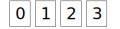
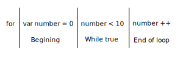

---
title: Farm Animals List
level: JavaScript
language: en-GB
embeds: "*.png"
materials: ["dist/*.*","res/*.*"]
stylesheet: web
...

# Introduction { .intro}

In this project, you’ll learn the basic concepts of programming using JavaScript.<br>

# Step 1: Creating the basic page { .activity}

Open up your favouite text editor to begin.<br>
Type into the editor the basic page structure that we are going to use for the rest of this tutorial.

```
<html>
    <head>
    </head>
    <body>
    </body>
</html>
```

Now save the file by clicking __File -> Save As__ making sure that the file is saved with '.html' at the end.<br>
<i>Ask you teacher if you need some help</i>

## Add a script block

JavaScript is a scriptis language that has much in common with so many other progamming languages.<br>
Because it is a scriptting language, JavaScript can be typed into yoou page with no need for any anitional software!

Let's add a script tag inside our `<head>` tag:

```
...
<head>
    <script>
    </script>
</head>
...
```

# Array of animals

Now we have added our script block, let's fill it with some script!<br>
We're going to fill our script block with an array of animals, but first let's see what an array is.

An array is a list of items, these item can be anything, they can be numbers or text, even other arrays or objects (we will get to objects later).<br>
Each item in a array has a position, this position is called an <i>index</i>.<br>
In JavaScript and most other programming languages the index of an array starts at 0, this is called a 0-based, as the base or start of the array is position 0.



Now let us add an array of animals to our script block.<br>
In JavaScript, arrays are written using square-brackets [ ] and each item in the array is seperated using a comma.<br>
We are also going to be using a special keyword called <i>var</i> to create what's called a <i>varible</i> to store the array into:

```
...
<script>
    var animals = [ "sheep", "cow", "pig", "hourse" ]
</script>
...
```

So now we have a <i>varible</i> called 'animals' that points to (assigned to) an array containing our favouite farm animals!

# Function

In order for us to display a list of animals, we need a place where our script can perfom that task, a <i>function</i> is just that, a peice of ou script that performs a task.<br>

Now inside our script block, just after our 'animal' array, let's type in our function.<br>
Make sure you leave a blank line to add some space and call our function something sencible.<br>
In most programming langauge, spaces between word are not allowed, therefore we use a combination of uppercase and lowercase to create names made up of multiple words.<br>
__Note:__ In JavaScript we use a kind of writing style is called <i>camelCase</i>, some other language use <i>PascalCase</i>.

When we write a function we have to use some more special charecters.<br>
The word <i>function</i> is a keyword that says that we are now writing a script block, the name we give our function is then followed by round bracets ( ), we then set the start and finish of our function by using squiggaly bracket { }, everything indide these brackets is our function.


```
...
function displayAnimals() {

}
...
```

Our function doesn't do anything at the moment, so let's add a little bit of script just so we can see it in action.<br>
Type the following inside of your function:

```
alert("Hello")
```

What do you suppose the above script will do?<br>
Yes that's right, the above script will display a alert saying "Hello".<br>
Now we have our function in place, now we need to call our function, we can do this using <i>Events</i>

# Events

Events are things that happen, such as loading a page or clicking a button, events are used to call a function that then performs a task.

We say what function we want to be called in our HTML, so let's do that now.<br>
We are going to use the <i>onload</i> event of the `<body>` tag to call our `displayAnimals` function:

```
...
<body onload="displayAnimals()">
...
```

At this point we can save our work again using __File -> Save__ and then double click on our file to open it in the browser.<br>
Our function should then run and a alert saying "Hello" will be displayed to you. You can also click on <i>Refresh</i> button to trigger the <i>load</i> event again.<br>
Remember to ask your teacher for help if needed.

Okay so this is fine biut we want to display animals, afterall that's what our funtion save it does.

# For loops
In JavaScript and other programming langagues, a <i>for loop</i> is a special piece of code that tells our script that we wish to repeat something a given number of times.<br>
A <i>for loop</i> is made up of three statments, the begining, while something is true, after each loop<br>
Each part of the <i>for loop</i> is seporated with a semi-colon (;).



+ At the begining of our <i>for loop</i> we are creating a varible called `index` which we are assigning the value 0.<br>
+ Next we say that we want our loop to continue while the index is less then 10 (< is the symbol for less then).<br>
+ Lastly we say that at the end of each loop we want to increase the number by 1 (++ is the symbol to increase by 1).

Now we have learned how to create a <i>for loop</i>, let's put one into our function!

## Adding <i>for loop</i> block to our function

Let's change our alert to say the names of our animals instead of just saying "Hello":

```
...
for (var index = 0; index < animals.length; index++) {
    alert(animals[index])
}
...
```

In the above code we are we have created a loop block that will start at the begining of our animal array __(remember arrays are 0 based)__ that will continue while the index varible is less the length of our animal array<br>
__Note:__ Here we are using the <i>Array.length</i> property, you can read more about the property [here](https://www.w3schools.com/js/js_arrays.asp)

So now we have a nice alert box displaying our animals one by one but our page is still blank, it would be nice to display our animals on our page.

# Displaying animals on the page

Now lets change our `displayAnimals` function again, this time we are going to use something call the __Document Object Model__ or __DOM__ to add HTML elements to our page.<br>
__Note:__ You can read more about the Document Object Model [here](https://www.w3schools.com/js/js_htmldom.asp)

The first piece of code that we are going to add will get the `<body>` element of our page and store that in a varible.<br>
Type this code as the first line of our `displayAnimals` function.

```
function displayAnimals() {
    var body = document.body;
...
```

It the above code, we are getting the main `<body> element of our page and storing it into a varible<br>
__Note:__ You can read more about the __document.body__ [here](https://www.w3schools.com/jsref/prop_doc_body.asp)

Now that we have the `<body>` tag stored as a varible, we can now add code inside our <i>for loop</i> that will use this varible and add our animals to it.<br>

```
for (...) {
    var div = document.createElement('div');
    div.innerHTML = animals[index];
    body.appendChild(div);
...
```

In the first statement we are saying that we want to create a division (div) element and storing that element in a varible called `div`.<br>
Next we are assigning our animal to the `innerHTML` property of our element.<br>
Lastly we are adding our created element to the body element of our document.

## Add structure

So now we're almost there, let's just add a little bit of structure to our page to make it look better.

Let's add a divison (`<div>`) element just inside our `<body>`, we will also give this element an ID so that we can reference it from inside our JavaScript function<br>
Because our `<div>` is a container for all our animals to go into, what would be a good name for our animal container?<br>
That's right let's call it "animal-container"!

```
<body>
    <div id="animal-container">
    </div>
</body>
```

So now we have a place to put all our animals, let's change our function to reference this element.<br>
In our code, we can replace the statement `var body = document.body;` with `var container = document.getElementById("animal-container");`<br>
__Note:__ I have also renamed he varible to be called "container", as this is more sencible now that we are not using the <body>, make sure you rename the varible in all places that it is used.

Okay one last thing, let's now give the `<div>` that we are creating some style!<br>
Type this code after we create the `<div>` element:

```
div.style.width = 200
div.style.display = "inline-block"
```

Can you guess what the above code is doing?<br>
Well the first line is simple, we are setting the width to be 200.<br>
The next line isn't so straight forward, we are changing the `<div>` to display as a block.

You can fin out more about [style.with here](https://www.w3schools.com/jsref/prop_style_width.asp).<br>
And more about [style.display here](https://www.w3schools.com/jsref/prop_style_display.asp).

# End of lesson

Phew so that's the end of this lesson, in the next lesson we will add to our webpage to make it more colourful and interesting, for now just relax and let what we have learnt sink in.

