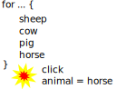

---
title: Farm Animals Objects
level: JavaScript
language: en-GB
embeds: "*.png"
materials: ["dist/*.*","res/*.*"]
stylesheet: web
...

# Introduction { .intro}

In this lesson we will start from our previous Farm Animals List lesson and add some images and interaction.

# Click event

Next let's add a event to each animal so that when it is clicked upon it's name will appear in a alert box<br>
First of all we want to create a new varible that we will store the animal into:

```
var animal = animals[index];
```

In the above statement we are retrieving the animal from the array using the index and storing it in a new varible called __animal__.<br>
Now we have the animal stored in a new varible we can add our click event.<br>
A `function` that is called when an event happens is called a __handler__, we can add a new handler to a element using the __addEventListener__ function.<br>
You can read more about the [addEventListener function here](https://www.w3schools.com/js/js_htmldom_eventlistener.asp)

```
img.addEventListener("click", function(event) {
    alert(animal.name)
});
```

## Something is wrong

If we now save our page and refresh our browser we can see that something is wrong.<br>
Every animal that we click on displays an alert that say "horse".<br>
This isn't right, not every animal is a horse, so what is going on?

When our page load the `displayAnimals` function is called, then inside this function the __for loop__ is performed.<br>
Some time later we click on an animal and the click event handler if called.<br>
Because the __for loop__ has now completed, the animal varible is still set to the last animal in the array.



## How to solve

What we need to do is to pass the animal varible to the event hadler each time the __for loop__ runs.<br>
But how pass data to the event handler?

We can do that by using a JavaScript library called __jQuery__.<br>
jQuery is a library that makes using JavaScript a lot more simpler, we can do more complex thing that just would not be possible for us to do without it.<br>
More spefificly, we are going to use a jQuery function called __on__.<br>
__Note:__ You can [read about the on function here](http://api.jquery.com/on/)

The first thing we have to do is to add a `<script>` tag for jQuery in the `<head>` section of our page:

```
<head>
    <script src="js/jquery.js"></script>
    ...
</head>
```

Here we have told our browser that we wish to load jQuery.<br>
__Note:__ Here the file `jquery.js` is inside a folder called `js`, if you do not have the file you could change the `src` attribute to https://code.jquery.com/jquery-3.2.0.min.js

Now we have added jQuery, let's change the event handler to use the __on__ function.

```
$(div).on("click", { animal : animal }, function(event) {
    alert(event.data.animal.name)
});
```

We can see her that now we are using the function called `on` instead of `addEventListener` and we are also using special sympols `$()` the wrap around our `<div>` varible.<br>
The reason that we wrap our div varible in special sympols is because `on` is a jQuery function, so we must make our div into a jQuery object by typing `$(div)`.<br>
The main difference we can see with the code above is that we are creating an object with a property called animal that we are passing into our event handler.<br>
We then use the object `event.data` from inside our event handler to retrive the animal object.

## Changing a property

So now let's change our event so that it does something more useful then just display the animal's name, let's change our event so that the computer remebers which animal we have clicked on.<br>
By clicking on a animal, we are choosing (or selecting) a animal, once that animal has been selected, we can then use that selected animal in other functions that we will create in later lessons.

Change your `click` event to the following code:

```
$(div).on("click", { animal : animal }, function(event) {
    var animal = event.data.animal;
    var isSelected = animal.isSelected;
    animal.isSelected = ! isSelected;
    $(this).toggleClass('selected');
});
```

Wow, now doesn't that look complicated?<br>
Let's break each line down to see what it is doing<br>
1) Firstly we are getting the animal from our event data and then assigning it to a new varible called `animal`
2) Next we get the animals `isSelected` property and put that into a new varible too. This varible will tell us wheather or not the animal is selected.
3) Now we set the animal's isSelected property to be the oposite of whatever our varible is.
The `!` symbol means `not`.
4) The special symbol `this` is a varible that points to the the object that is calling the event, because our varible `div` is triggering the event, `this` points to our `div` varible<br>
We are then calling the __toggleClass()__ event of the __jQuery__ object to toggle the __CSS class__ "selected" on and off.<br>
__Note:__ You can read more about the [__toggleClass()__ function here]()

## Style

It our code we are toggling the class "selected" on and off, but where is the class "selected"?<br>
Let's create it now.<br>
Insert the following code just inside your `<head>` element:

```HTML
<style>
#animal-container > div.selected {
    width: 200px;
    border: red solid;
}
</style>
```

This is a peice of __CSS__ code that we place inside a `<style>` element.<br>
Now this __CSS Rule__ might seem a little bit complicated, this rule is saying "Any `<div>` element with a class called "selected" that is a child of the element with the ID of "animal-container".

# Save and try

Let's save our work now and refresh our browser to try out our latest changes, all should be working perfectly.

# Tidy up

In the world of computer programming, tidying up or reorganising code is called __Refactoring__ (but this is just a posh word for tidying up).

## Using jQuery

So now we are using jQuery in one place only, but we could use it everywhere and it would make our life easier.<br>
Let's now change the `displayAnimals` function to use jQuery.

```JavaScript
function displayAnimals() {
    var container = $("#animal-container");
    for (var index = 0; index < animals.length; index++) {
        var animal = animals[index];
        var div = $('<div/>');

        div.on("click", { animal : animal }, function(event) {
            var animal = event.data.animal;
            var isSelected = animal.isSelected;
            animal.isSelected = ! isSelected;
            $(this).toggleClass('selected');
        });

        var img = $("");
        img[0].src = animals[index].img;

        div.append(img);

        container.append(div);
    }
}
```

So now we can see how jQuery has made things easier for us, instead of using functions from the `document` object, we can simply wrap strings of text using the special symbols `$()`.<br>
Actually, what goes inside the special symbols is called a <i>Selector</i>.<br>
You can read more about [jQuery selectors here](https://www.w3schools.com/jquery/jquery_selectors.asp)

The one bit of code that might confusse you is that we are using an array index when assigning the src property of our img `img[0].src = ...`.<br>
This is because the jQuery object is actually an array of elements, so we use a index to access the first element (rember array's start from 0).<br>
You can also notice that I have removed the lines of code that give syle to our `<div>`, I've done that so that we can we can add them again late using a stylesheet.

## Styling our page

The way we add style to our page is but creating __style rules__ inside a __stylesheet__, a stylesheet is saved in a special file called a __CSS__ file.<br>
We have a blank CSS file all ready for us, let's now type some style rules!

```CSS
#animal-container > div {
    display: block;
    width: 200px;
}
```

In the above style rule we are doing exactly the same as what we where doing in our code.<br>
We are saying that any `<div>` element that is below (`>`) the `animal-container` should display itself as a block and have a width of 200 pixels (a pixel is a unit of measurement used by computers).

Now that we have our stylesheet, let's add it to our page.<br>
Add the following just below the `<head>` element in our page.

```HTML
<link rel="stylesheet" type="text/css" href="styles.css">
```

Here we are saying that we wish to link to a stylesheet that is a text CSS file that is located in the file "styles.css".<br>
__Note:__ You can read more about the [`<link>` element here](https://www.w3schools.com/tags/tag_link.asp)

## Moving script

Let's now move some more of our code.<br>
Inside the `js` folder there are two more blank files, `animals.js` and `script.js`, these files end with `.js` which stands for `JavaScript`.<br>
Let's move our animals array into the `animals.js` folder.

## Moving the animals array

Drag your mouse over the entire __animals__ array and press the special cut command __Ctrl + X__.<br>
Now open up the file `animals.js` and press the special paste command __Ctrl + V__.<br>
Now our animals are well organised into a seperote file, but we still need to tell our page where the animals are.

We can tell our page to look for the animals in the file `animals.js` by copying the following code into your `<head>` element.

```HTML
<script src="js/animals.js"></script>
```

This is a simple bit of code.<br>
Here we telling our page that we would like to use some scrip, and the __source__ (`src` means source) is located inside the `js` folder in a file called `animals.js`.

## Moving the `displayAnimals` function

Drag your mouse over the entire __displayAnimal__ function and press the special cut command __Ctrl + X__.<br>
Now open up the file `script.js` and press the special paste command __Ctrl + V__.<br>
Now our displayAnimal function is well organised into a seperote file, but we still need to tell our page where the displayAnimal function is.

We can tell our page to look for the displayAnimal function in the file `script.js` by copying the following code into your `<head>` element.

```HTML
<script src="js/script.js"></script>
```

This is a simple bit of code.<br>
Here we telling our page that we would like to use some scrip, and the __source__ (`src` means source) is located inside the `js` folder in a file called `script.js`.

## Make sure it still works

# End of lesson

Phew so that's the end of this lesson, in the next lesson we will add to our webpage to make it more colourful and interesting, for now just relax and let what we have learnt sink in.

