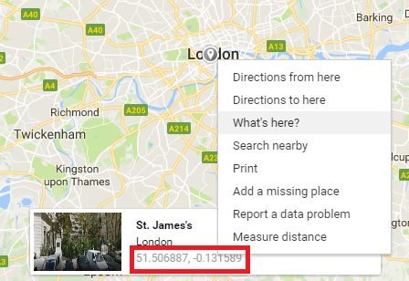

---
title: Countries Maps
level: JavaScript
language: en-GB
embeds: "*.png"
materials: ["dist/*.*","res/*.*"]
stylesheet: web
...

# Introduction { .intro}

Our farm countries at not just confined to one farm, but they live in many different locations all over the world.

In this lesson we will add a __location__ property to our countries and display their locations on a map.<br>
There are many different maps on the internet, but we are going to be using Google Maps.<br>
__Note:__ You can read about [Google Maps here](https://www.w3schools.com/graphics/google_maps_intro.asp)

First of all we will have to make some changes too our page.

# Changes to `page.html`

We will need to make three changes to our page.
1) Reference Google Maps
2) Add a button
3) Adding the output `<div>`

## Reference Google Maps

The first thing we have to do it to add a `<script>` at the top the references the Google Maps library.<br>
At the top of your page, inside the `<head>`, place the following code:

```HTML
<script src="https://maps.googleapis.com/maps/api/js"></script>
```

Here we are saying that we want to include a new script with it's source at the Google Maps website.<br>
```
If you are curious, API stands for Application Programming Interface
```

## Add a button

Before we can add a button, we need a place where we can put it, similar to the country container, but for buttons, what shall we call it?<br>
That's correct, let's call it `button-panel`.<br>
Type the following code underneath the `countries-container`.

```HTML
<div id="button-panel">
</div>
```

Now we can add a button to our button panel.<br>
When we click on this button, it will display the selected country location on a map.<br>
Place the following `<button>` element inside your button panel.

```HTML
<div id="button-panel">
    <button onclick="displayCountryLocation()">Display Location</button>
</div>
```

Here we are creating a new `<button>` that says "Display Location" and we type the name of the function that will display the country for the __onclick__ event.<br>

## Adding the output `<div>`

We need a place to put our map once the button is pressed.<br>
We will now add a new `<div>` element underneath the button panel.

```HTML
<div id="output" style="width:100%;height:400px;">
</div>
```

That is all the changes we have to make in our HTML page, now let's add the script to make it work!

# Changes to `countries.js`
## Add each country's location

Let's add a new property to each country, this property will be called __location__ and it will be an object made up of two more properties: __lat__ and __lng__:

```JavaScript
location : {
     lat : -7.477825,
     lng : 178.679838
}
```

But what do they mean?<br>
Well, in geography, locations or coordinates on the earth are represented using two numbers called __latitude__ (lat) and __longitude__ (lng).<br>

We can use the internet to find some coordinates.<br>
Open up a web browser and navigate to https://www.google.co.uk/maps/<br>
Now click on the right mouse button and a menu will appear, click on the option that says "What's here?"<br>
Once you have clicked on the button, a window will appear at the bottom of the screen, inside this window you can see the name of the location you have clicked on, underneath the name are the latitude and longitude coordinates.<br>



Now you know how to find your own latitude and longitude coordinates, you can use your own coordinates or use to ones in this lesson.<br>
Here are some example coordinates:

```JavaScript
var countries = [
    { name : "Bermuda", ... location : { lat : 32.318942, lng -64.749584 } },
    { name : "Bhutan", ... location : { lat : 27.395674, lng : 90.449783 } },
    { name : "Fiji", ... location : { lat : -17.496026, lng : 178.724850 } },
    { name : "Galapagos", ... location : { lat : -0.526364, lng: -90.691124 } }
];
```

Now that we have the country objects set up, let's move on to the function that will display these locations on a map.

# Changes to `script.js`

Let's add a empty `displaycountryLocation()` function that we will add code to later:

```JavaScript
function displaycountryLocation() {

}
```

So now that we have our function in place, let's think about what we want to put in it.<br>
Let's break our function down, what do we want to do?
1) Get the selected country.
2) Display the selected country's location a map

Okay so we can see that there are two things that we want to do in our function, let's take them in turn.

## Get the selected country

So let's now create a function that we will use to get the selected country.

```JavaScript
function getSelectedcountry() {
    return countries.find(function(country) {
        return country.isSelected
    });
}
```

This might look a little bit complicated, we have two return statements, let's see what is going on.<br>

+ In the first return statement we are calling the function __find()__ that is a function of the Array object (countries is an Array)<br>
__Note:__ You can read more about the [find() function here](https://www.w3schools.com/jsref/jsref_find.asp)
+ The second return statement is inside the find function, we want to find the country that is selected, so inside the find() function we create another function that take a country and returns it's `isSelected` property<br>
This function will be called for every country untill a selected country is found.

So now let's use our new function in our main function:

```JavaScript
function displaycountryLocation() {
    var selectedcountry = getSelectedcountry();
}
```

Here we are creating a new varible that is assigned to the return result of the `getSelectedcountry()` function.<br>

So that's the first part of our function done, now on to the second.

## Display selected country's location on a map

Now we move on to creating the second part.<br>
Let's also create this part as a new seperote function.<br>

```JavaScript
function displaySelectedcountryOnMap(selectedcountry) {
    var output = $("#output");
    var map = new google.maps.Map(output[0], {
        center: country.location,
        zoom: 8
    });
}
```

In this code there are two statement (two semi-colons (`;`)).<br>
Let's take a look at what each statement is doing.<br>

+ In the first statement we get a reference of our "output" `<div>` element that is on our page.<br>
Remember we do this by using the special `$()` symbol arround the ID of the element.
+ In the secound statement we are creating a [Google Maps Object](), we are giving it our "output" `<div>` element by using the special array index symbol on our varible (`output[0]`).<br>
We are also giving the `Map()` function a configuration object that has two properties: center and zoom.<br>
We wish to centre the map on the country's location, so we assign the `country.location` property to the `center` property in the configuration object.<br>
We also set the `zoom` property because we want to zoom our map into the country's location.<br>

Now that we have created our, we can now use it in our main function.<br>
Place the code to call our newly created function after we get our selected country:

```JavaScript
function displaycountryLocation() {
    var selectedcountry = ...
    displaySelectedcountryOnMap(selectedcountry);
}
```

Here we are calling our function and giving it our selected country.

# It works!

Now we have created all the parts for our main function, let's save our work and open up the page in a web browser.<br>
To test that everything is working, click on a country to select it and then click on the "Display Location" to display a map with the selected country's location.

But there is one problem.<br>
Not every selected country is displayed on the map, if we select more than one country, we would like all of the country locations displayed on the map, not just one.

Let's make the changes so that all countries are displayed.

## Get all selected countries

Let's create another function to get all selected countries.<br>
Type the following code:

```JavaScript
function getAllSelectedcountries() {
    return countries.filter(function(country) {
        return country.isSelected
    });
}
```

This is a simple change to our previous function.<br>
All we have done here is change the name of our function, `getAllSelectedcountries` is a nice descriptive name, and we are now using the `filter` function of our `countries` array.<br>
The filter function will return all the selected countries rather then just the first one it finds.<br>
__Note:__ Read more about the [filter() function here](https://www.w3schools.com/jsref/jsref_filter.asp)

## Changing the displayOnMap function

This change is a little bit bigger than the last.

The first change we want to make is to move the `map` varible outside of the `displaySelectedcountryOnMap` function.<br>
Then we want to add a `if` arround the `Google Map` function call.<br>
Replace your `displaySelectedcountryOnMap` function with the following code:

```JavaScript
var map;
function displaySelectedcountryOnMap(country) {
    var output = $("#output");
    if (! map) {
        map = new google.maps.Map(output[0], {
            center: country.location,
            zoom: 8
        });
    }
}
```

You can see that our `if` statement is saying "if not map" this means that "if the map is nothing or if map is empty", as we are not assigning anything to `map`, th `map` varible is empty.

But this is not the only change that we want to make, we also want to add a marker on our map.<br>

### Add a marker

Now let's add a marker.<br>
We want to do this inside our function, below the `map` if statement.<br>
Type the following code:

```JavaScript
if (! map) {
    ...
}
var marker = new google.maps.Marker({
    position: country.location,
    map: map,
    label: country.name
});
```

In this code above we are adding a new [Google Map Marker](https://developers.google.com/maps/documentation/javascript/examples/marker-simple).<br>
The Marker object also takes a configuration object, we are setting the congfiguration object's properties using the country's location and name, we are also telling the Marker that the map we want to use is our `map` varible.<br>

The last thing we have to do is make changes to our main `displaycountryLocation` function.

## Changes to displaycountryLocation function

We are now going to make three changes to our main function.<br>
Let's look at the following code:<br>

```JavaScript
function displaycountryLocation() {
    map = null;
    var selectedcountries = GetAllSelectedcountries();
    selectedcountries.forEach(displaySelectedcountryOnMap);
}
```

Our function is now made up of three statements:

1) We are making sure the `map` varible is nothing (null in computer terms) by assign the special keyword 'null' to it.
2) We are getting all the selected countries by calling our new function that returns all selected countries.
3) We are calling the `forEach()` function of the `selectedcountries` array.<br>
The `forEach` function does exactly the same as a `for...loop`, only it is easier to understand because it is a function.<br>
__Note:__ Read more about the [forEach function here](https://www.w3schools.com/jsref/jsref_forEach.asp)

# End of lesson

Phew so that's the end of this lesson, in the next lesson we will add to our webpage to make it more colourful and interesting, for now just relax and let what we have learnt sink in.

